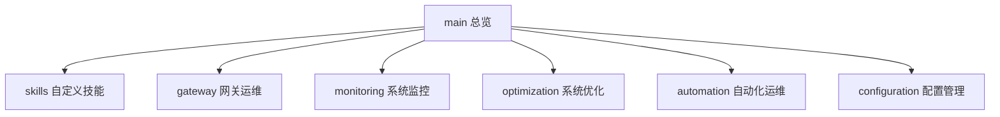

# OpenClaw 技术实战库

> OpenClaw 的故障修复、系统优化、自定义技能与自动化运维知识库

## 📋 项目结构



| 分支 | 内容 | 状态 |
|------|------|------|
| `main` | 项目总览、索引 | ✅ |
| `skills` | 自定义技能开发指南（gh-ops等） | ✅ |
| `gateway` | Gateway 故障排查、重启风暴修复 | ✅ |
| `monitoring` | 系统监控脚本和策略 | ✅ |
| `optimization` | 系统优化记录 | ✅ |
| `automation` | 定时任务、日志轮转、自动维护 | ✅ |
| `configuration` | 配置管理最佳实践 | ✅ |

## 🎯 目标

1. **记录实战经验** — 每次故障修复、优化都沉淀为可复用的文档
2. **持续增强 AI 能力** — 通过自定义技能扩展 OpenClaw 的功能边界
3. **系统健壮性** — 建立规范化的运维体系，防患于未然
4. **快速恢复** — 任何故障都能按文档快速恢复

## 🔧 关键成果

- [Gateway 重启风暴修复 →](gateway/gateway-restart-storm-fix.md)
- [gh-ops 自定义技能 →](skills/gh-ops-skill-guide.md)
- [天气预报脚本修复 →](gateway/weather-script-v3.md)
- [系统优化全记录 →](optimization/system-optimization-log.md)
- [crontab PATH 修复 →](automation/crontab-path-fix.md)

## 🚀 快速使用

```bash
# 查看 Gateway 状态
openclaw gateway status
systemctl --user status openclaw-gateway.service

# 查看技能
ls ~/.openclaw/workspace/skills/

# 查看实时日志
tail -f /tmp/openclaw/openclaw-$(date +%Y-%m-%d).log
```

## 📅 更新日志

| 日期 | 更新内容 |
|------|---------|
| 2026-05-23 | 项目初始化，整理全部技术沉淀 |

---

*维护者: weixiaobao1976*